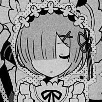
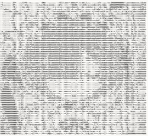
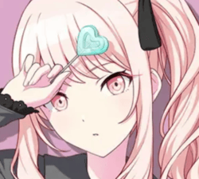
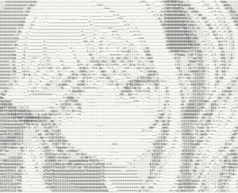

wow first readme, kinda nervous.
> NOTE: line 56-79 in /frontend/index.html was written with the help of an LLM (i am sorry :c)
# J.A.S.C.I.I
> Jassi's image (maybe even videos later c: ) to ASCII art program, it uses C for the ASCII generation and *web technology* for the front end. Watch it
[live](https://jascii.jassi.dev/)

## Some Examples
(Rem from rezero, i am sorry idk where the art is from)  

  
(Mizuki Akiyama from project sekai, image is from: https://projectsekai.fandom.com/wiki/Akiyama_Mizuki?file=Mizuki+3rd+Anniversary.png)  

  
### Why should i use this?
umm because:
1. It's free :)
2. Your images (and potentially videos in the future) are not going to some random data center so that Zuckerberg can feed it to meta
3. It's freeeeeeeeeeeeee :D
4. Why not? 

### How to use
1. Go to the [website](https://jascii.jassi.dev)
2. Simply upload the picture. (Note: Only `.jpg`, `.jpeg`, and `.png`formats are allowed)
3. Ta-da! There you have it.
4. Use the reset button to convert another image to ASCII.

> Credits to Sophie for helping with WASM implementation  
thats it, jassi out :)